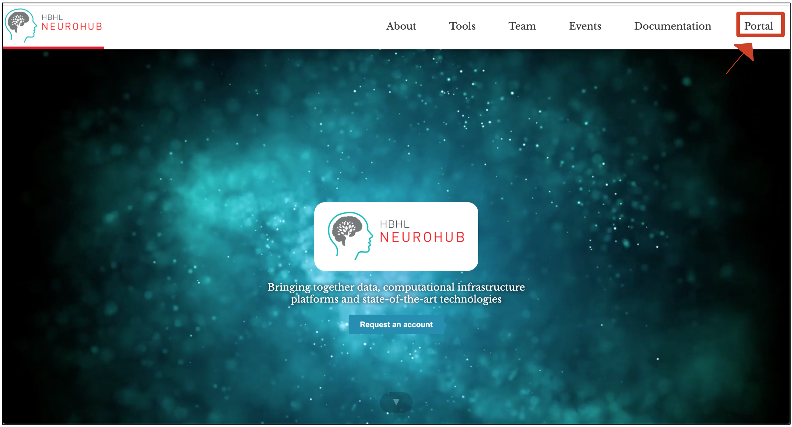
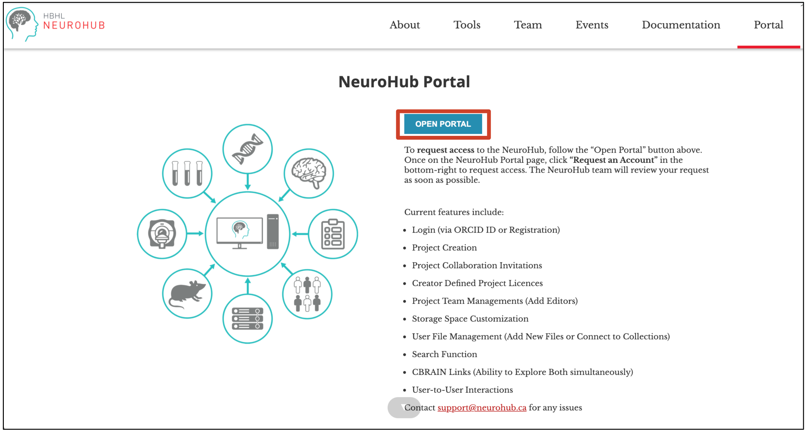
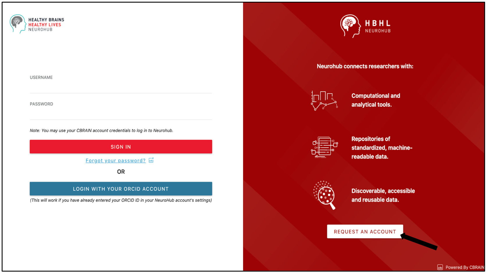
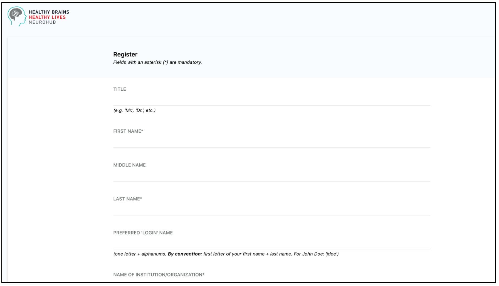
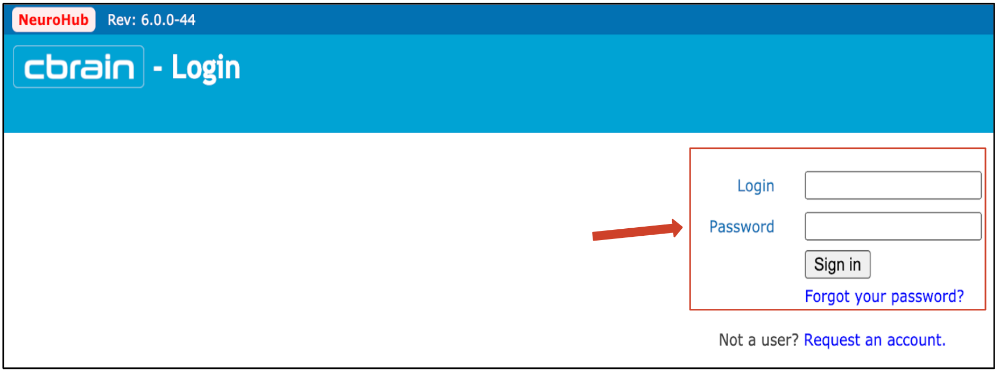

In order to help you getting started and set up with a NeuroHub account, please follow the outlined steps below. Should you encounter problems along the way, please contact us via support@neurohub.ca.

### Procedure

1. Go to [www.neurohub.ca](https://neurohub.ca/).  
2. Click on “**Portal**” in the upper right corner:   
3. You will land on the [Portal information page](https://neurohub.ca/portal.html)  
4. Click on “**OPEN PORTAL**”:   
5. Click on “**REQUEST AN ACCOUNT**”:   
6. Fill in the registration form using your institutional email address and click on “**REQUEST AN ACCOUNT**”:   
7. You will receive an email; click on the link to confirm your email address.  
8. Wait until you receive the approval of your account via email.  
9. You will receive your username and your temporary password to login. Click on the link and log in to the [CBRAIN](http://www.cbrain.ca/) component of NeuroHub and change your temporary password:
  

After completing these steps, everything necessary should be set up and you should be ready to start using NeuroHub!  

Once successfully registered, you can access the portal [here](https://portal.neurohub.ca).

