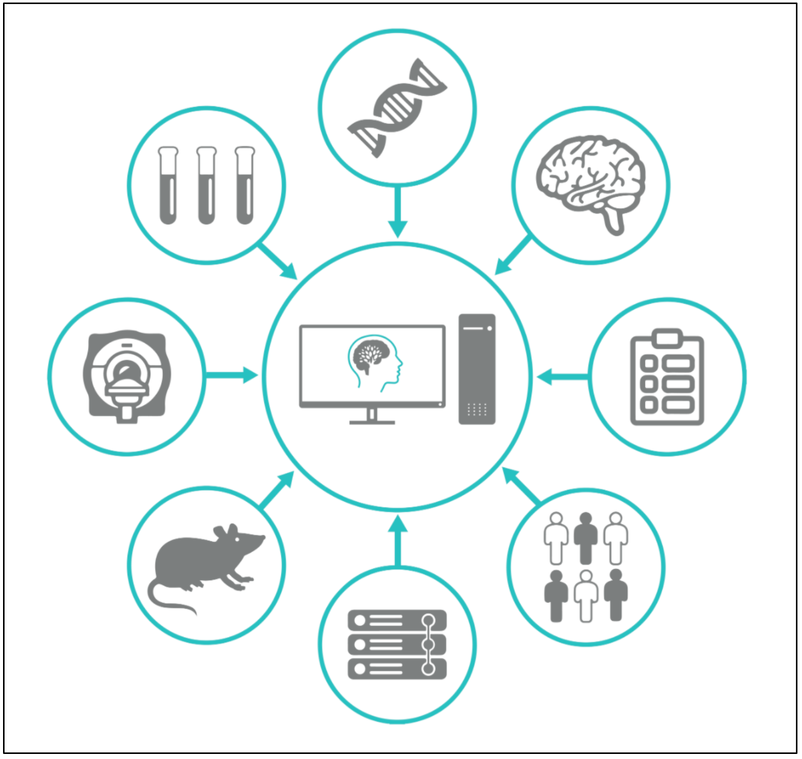

Within this section of the documents, you will find important information regarding the usage of NeuroHub. 

It includes the following parts:

[2.1. Access Neurohub](2.1.Access-NeuroHub)

[2.2. Creating a Project](2.2.Creating-a-project)

[2.3. Using the LORIS Data Query Tool (DQT)](2.3.Using-the-LORIS-Data-Query-Tool-(DQT))

[2.4. Jupyter Notebooks](2.4.Jupyter-Notebooks)

[2.5. Messaging in NeuroHub](2.5.Messaging)

***
A step-by-step guide introducing NeuroHub is available via the video from the Workshop [_Fundamentals of the NeuroHub Platform_](https://neurohub.ca/events-article-5.html)! 
***

