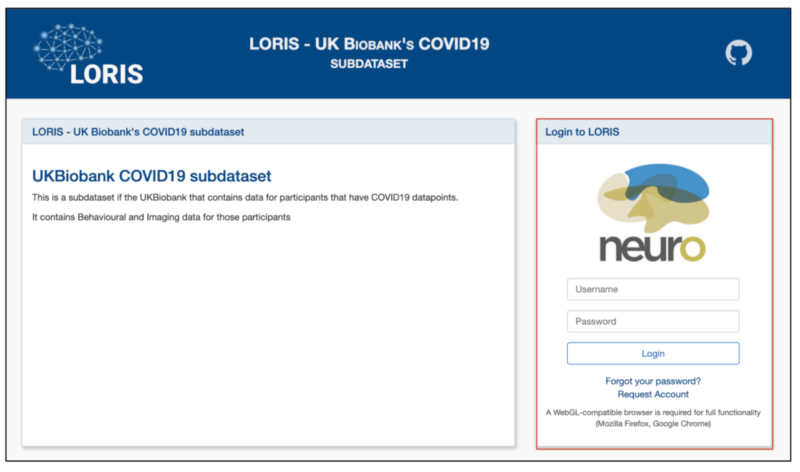
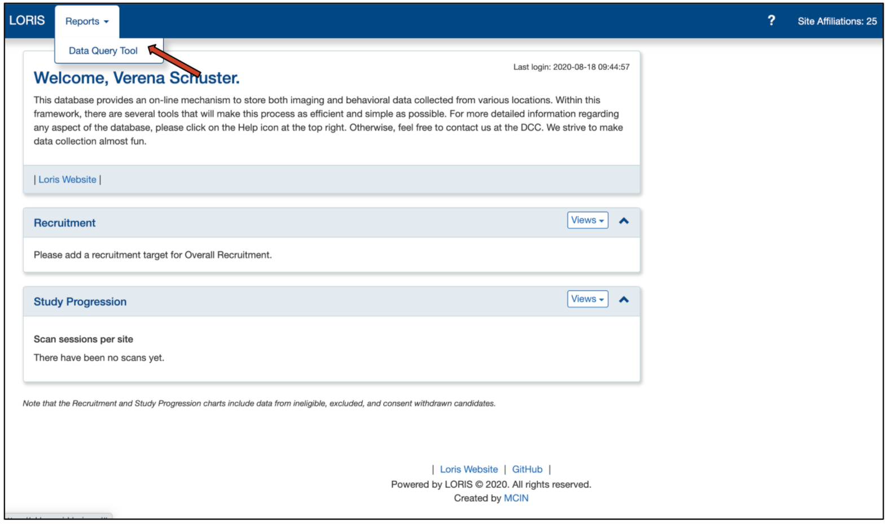
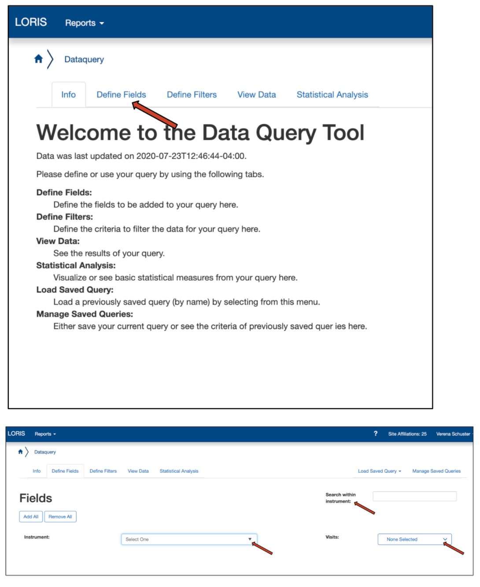
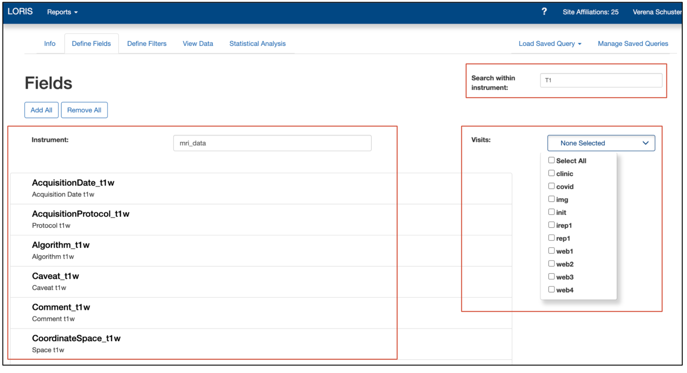
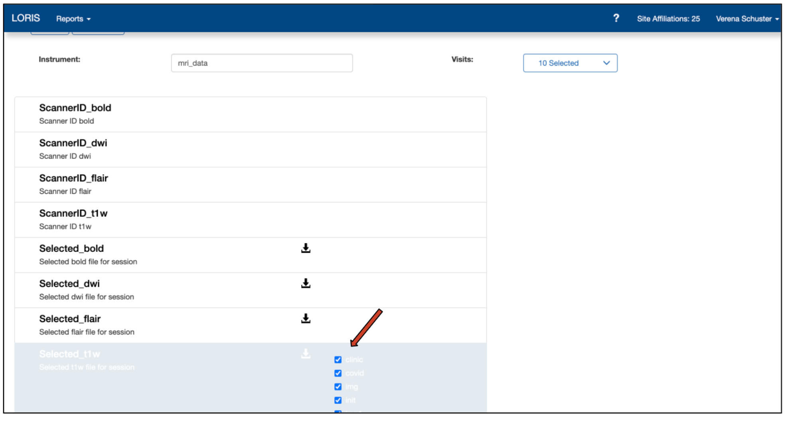
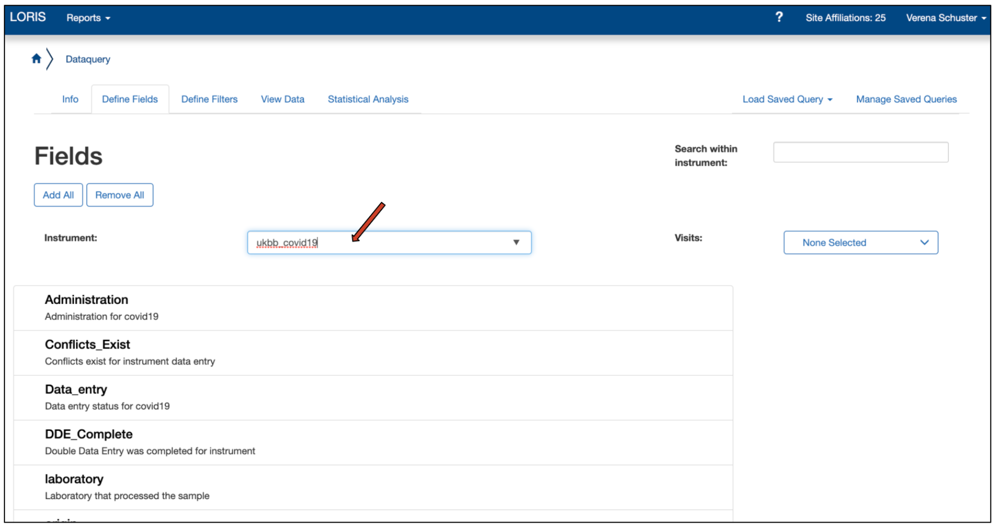
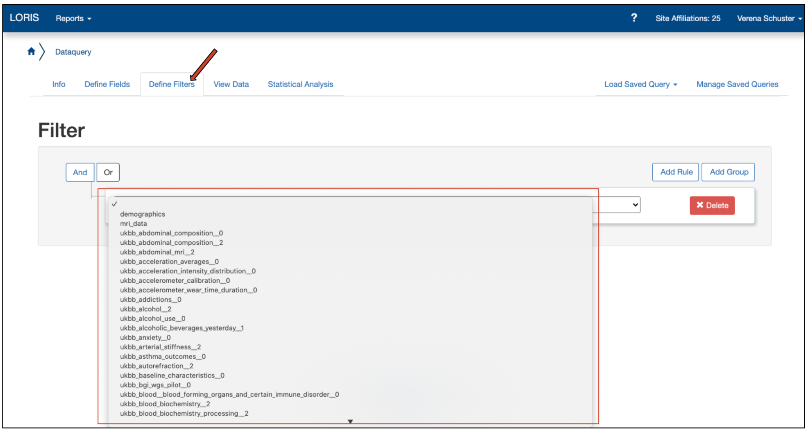
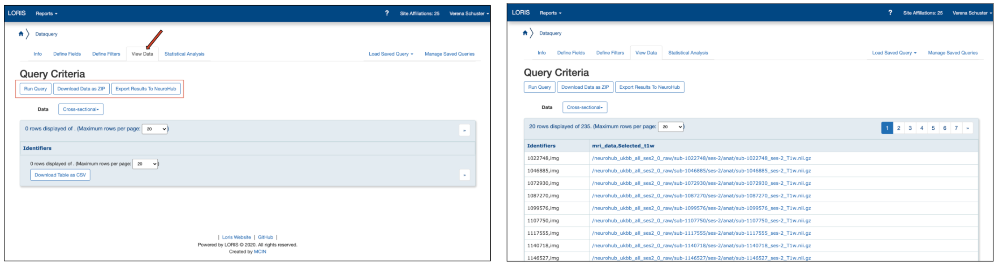
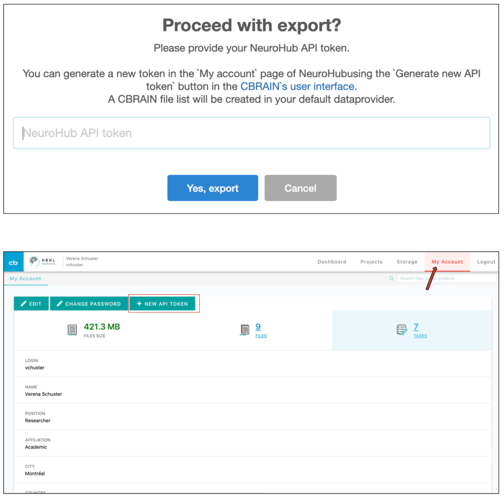
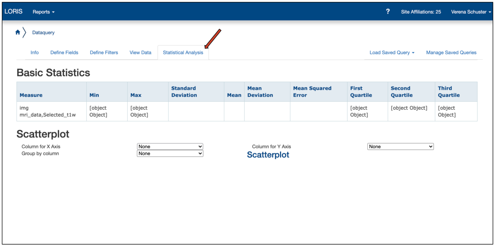

### Using the LORIS Data Query Tool (DQT)
***

“LORIS (Longitudinal Online Research and Imaging System) is a self-hosted web application that provides data and project management for neuroimaging research. LORIS makes it easy to manage large datasets including behavioral, clinical, neuroimaging and genetic data acquired over time or at different sites.” [https://github.com/aces/Loris](https://github.com/aces/Loris)

LORIS is a core component of the NeuroHub platform. 
This special instance of LORIS has been adapted to house all the brain images of the UK Biobank dataset along with these participants' “tabular” data.
* 39 677 participants
* 182 instruments
* ~ 20TB of nifti image files (t1, dwi, flair, rfmri) 

The DQT module allows users to select variables of interest and apply filters on the population.
It is harnessing the power of a “nosql” database by querying prebuilt indexes built from map-reduce functions organised in views.
The results can be downloaded as CSV and file attachments or exported to NeuroHub using CBRAIN’s HTTP API.

***

!A step-by-step guide will be available via the video from the _Workshop: Accessing the UK Biobank and the Data Query Tool_ soon! 
***

### Step by step

* Login to LORIS [https://ukbb.loris.ca/](https://ukbb.loris.ca/)

### Example #1

Load a saved query and run it.
* In the _Shared Saved Queries_ section, choose _Tutorial 1_

* Go to _Run Query_ step and click the _Run Query_ button

### Example #2
* Go to Define Fields step 

* Select the _ukbb_t1_structural_brain_mri__2_ instrument

* Click on the _20252_t1_structural_brain_images___nifti_ field

* Run the Query again

### Example #3 Add a filter
* Go to _Define Filters_ step 

* Click on the _Add rule_ button
* Select the _ukbb_covid19_ instrument
* Select _result field_, = operator and the value 1

* Run the Query again

**Instruction on how to create a query**

To start a new query, use the above navigation and or click on _"Define Fields"_ to begin building the fields for the query.

You may choose to then click the navigation again for the _"Define Filters (Optional)"_ and define how you will filter the query data.

Lastly, navigate to the "_Run Query"_ and run the query you built.

For information on data fields, categories and encoding, please visit the UK Biobank Data Showcase.
The schema files used to organize the data in this database can be found at [https://biobank.ndph.ox.ac.uk/showcase/schema.cgi](https://biobank.ndph.ox.ac.uk/showcase/schema.cgi)

### Example #4 Export Data to Neurohub

* Login to [NeuroHub](https://portal.neurohub.ca/signin) 
* go to _My Account_ page and generate an API token by clicking on _+ New API Token_ 

* In the DQT, run query again.
* Click on the _Export Results To NeuroHub_ button
* Paste your token in the prompt.
* Click _Yes, export_

***

### Using the DQT for the COVID-19 dataset in the UK Biobank
***

This documentation provides a brief overview on how to perform the data selection (image data and behavioural data) of the COVID-19 datasets in the UK Biobank and it’s visibility into NeuroHub. 

###  Context
[ukb-covid.loris.ca](https://ukb-covid.loris.ca/) holds a reduced set of data for the UKBiobank participants having COVID19 records. From the Data Query Tool **(DQT)** module, you will be able to query that dataset for any variable (fields) along with T1w provided in our ukbb application. 
Clicking the Export to NeuroHub button, all selected fields will be saved in a _csv_ file in your _NeuroHub_ project. If the selected fields contain images files, a special file (_CBRAIN File List_) will be created. This special file will allow users to use the copy of the file that resides on Compute Canada without avoiding the creation of a copy of all those image files.

### Prerequisite
You need an approved UKBiobank account before requesting a LORIs account (details on the application process can be found [here](1.2.UKBiobank-Access-Request). After having filled the request account form for UKBiobank data access, you should have received an email from _no-reply@ukb-covid.loris.ca_ containing a password to access a LORIS instance.

### Step by step
- Go to [https://ukb-covid.loris.ca/](https://ukb-covid.loris.ca) 
- Login using your email address and the password from the email. 
  - If it is the first time you login, you will be prompted to enter a new password

- You are directed to your dashboard

- Yse the menu _Report > Data Query Tool_ at the top to access the **DQT** module [here](https://ukb-covid.loris.ca/dataquery/)
- Now, you can see the overview of the **DQT** 

### Query the data 
#### Define Fields
- Select Define fields
  -Instrument: To select a field, first choose an instrument then select the desired fields. The UKbiobank organized the data in a [tree](https://biobank.ndph.ox.ac.uk/showcase/browse.cgi) where nodes are categories and the leaves are the fields (variables). The instruments in the DQT are the first parent nodes of each field.
    - ex: [Vocabulary level](https://biobank.ndph.ox.ac.uk/showcase/field.cgi?id=6364) is under its parent category [here](https://biobank.ndph.ox.ac.uk/showcase/label.cgi?id=504).
    - *Special cases for demographics, images and covid19.
      - Demographics contain LORIS specific fields about the participants (e.g.: Date of birth, Sex).
      - * Note about date of birth. The dataset only contains the year of birth and month of birth. We set the day of birth to the 15 of each month for every participant.
  - use _mri_data_ and select _Selected_t1 w_ to get access to the structural images
      - you will see a download icon, indicating that these fields are files by themselves (instead of scalar values), thus they will be handled differently during the Download and Export step
- _Search with instrument:_ Here, you can enter a free text (e.g. T1w)
- _Visits:_ with this option you can further narrow your search

- click on the files you are interested in, these are then summarized under _Fields_ on the right side of the page

- another useful instrument is ukbb_covid19, which includes the fields laboratory, origin, result, specdate, spectype). 

#### Define Filters (optional)
- to add a filter, select an instrument and a field then enter the condition (operator + value)
- filters can be grouped using AND or OR operators. Use the _Add Group_ and _Add Rule_ button to create the desired filters

#### View data
- click _Run Query_ to see the results. It can take a few minutes to load. 

- the data can be downloaded (_Download Data as ZIP_) in the browser or exported to NeuroHub (_Export Data to Neurohub_)
  - Download Data as a _csv_
    - This option is available at the bottom of the data table using the _Download Table as CSV_ button. The data in the table will be sent to the browser as a single csv file. For images, the url of the file will be “displayed” in the csv. 
  - Download Data as ZIP	
    - This is identical to the “_Download Data as a csv_” with the exception that Image files will be downloaded automatically and zipped in the browser. 
  - Export Data to Neurohub
    - a modal window will appear asking to provide a NeuroHub token
    - to obtain that token, go to My Account page in [NeuroHub](https://portal.neurohub.ca/)
    - copy the token in the API token section (_Neurohub API token_)

- the exported data is listed under _Latest Updated Files_ on your Neurohub Dashboard

#### Statistical Analysis
- this option allows to perform summary statistics (e.g. min, max, avg) 
- additionally, an R-square plot (Scatterplot) can be created for the variable of interest 

