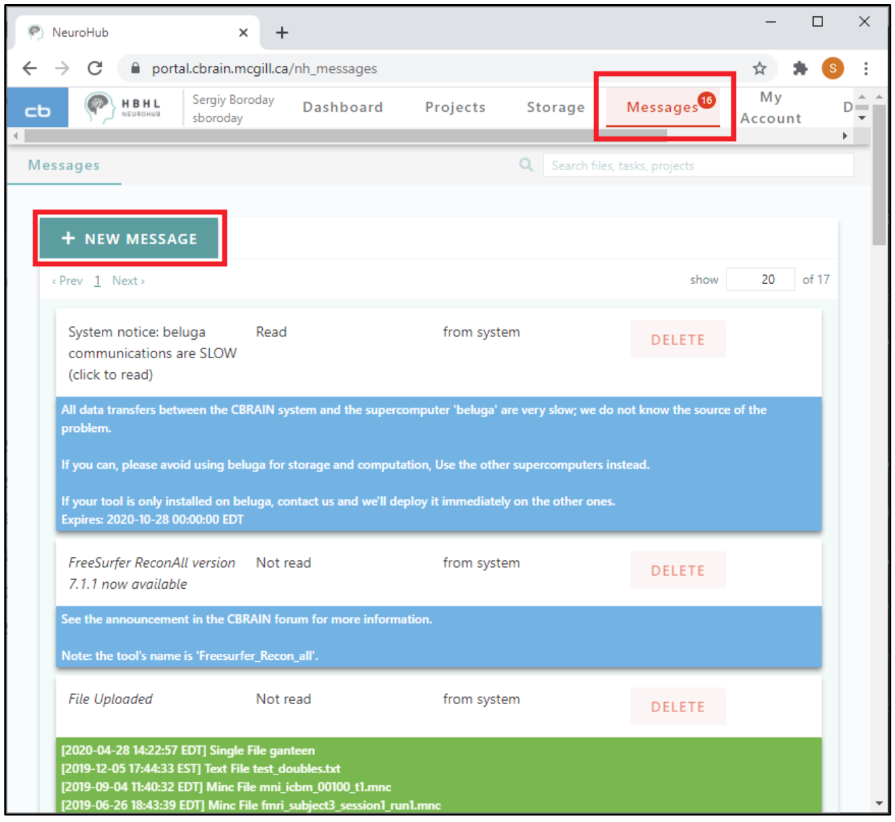
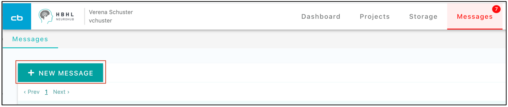
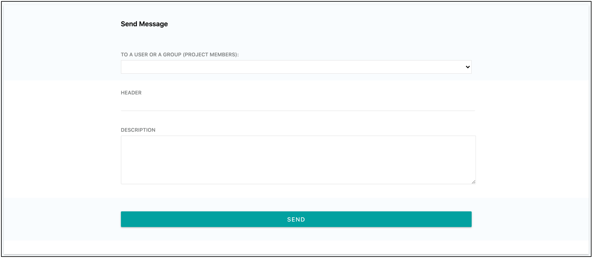

NeuroHub offers a simple and intuitive messaging system. 
You can access messages from the system or from other users who collaborate with you on different projects. 
You can send messages to individual users who belong to shared projects or to all users of these projects. 

* To read the messages from the system and other users, simply click on menu item **“Messages”**. 
* The user messages are shown on tan backgrounds, and system messages are on a blue, green, or red background. 

* You also can send a new message to your co-members. 
* To send a message, you should first click on **“Messages”** and then on **“New Message”**.

