In the following we will provide a step by step guide how to analyze structural data within the Neurohub platform will be given. This example is used to familiarize the user with the general procedure of analyzing data. As a general remark, all analyses will be performed on **CBRAIN**, a platform that facilitates collaborative research on large, distributed data by creating an interface between a user and high-performing computing centres. A detailed **CBRAIN** user guide is available [here](https://portal.cbrain.mcgill.ca/doc/manual/CBRAINGettingStartedGuideFeb15.pdf). 

#### 1. Click on your project, including the file you wish to analyze, you'll be are redirected to your project summary 

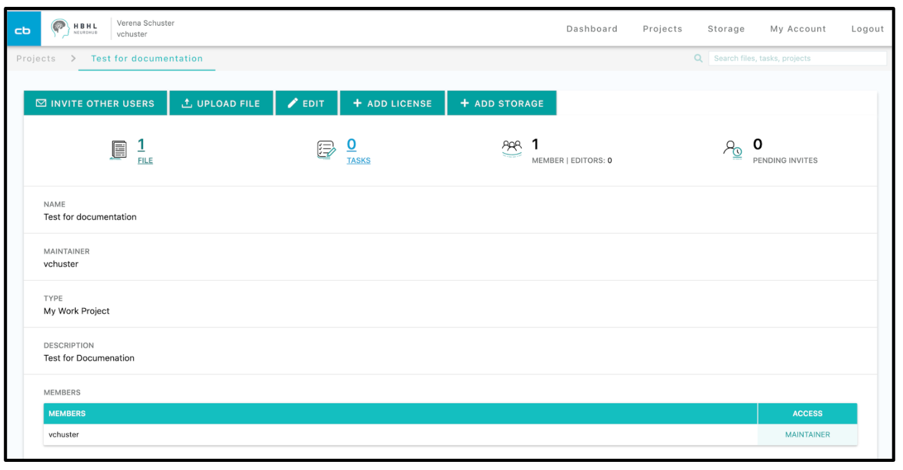

#### 2. Click on the “**file**” icon in the upper left

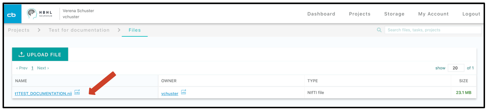

#### 3. Click on the file, you are redirected to the **CBRAIN** interface of **NeuroHub**, to see your file overview and a first glimpse of your data 

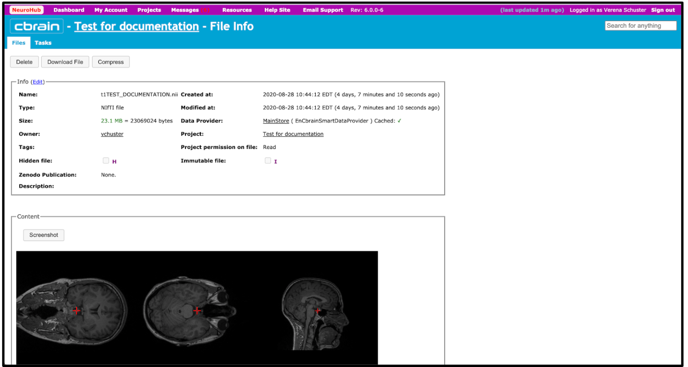

   * _here you can additionally check your data and detect for example artifacts_

#### 4. To start the analysis, click on “**Projects**” in the upper selection bar

#### 5. You now land on your **CBRAIN** dashboard, where your and all public available projects are summarized 

#### 6. Click on the project that includes the data that you want to analyze

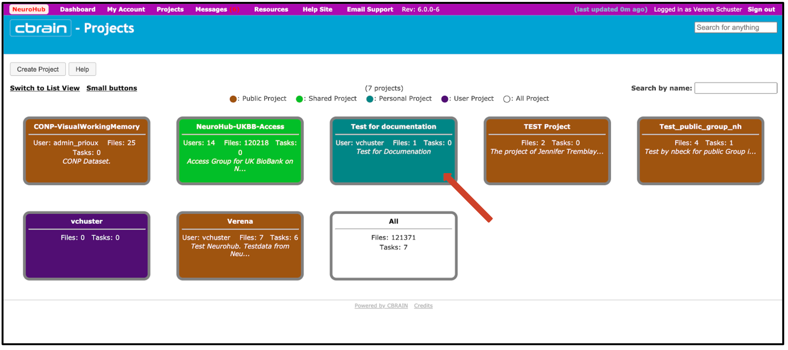

#### 7. You will see a table with your uploaded file

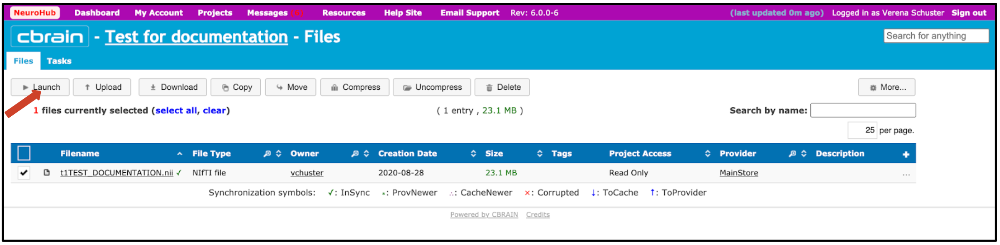

#### 8. Select your file and click on the “**Launch**” button

#### 9. Now, you can select a analysis tool on the right side or reduce your selection by clicking on your data type, your preferred software package or any tags on the right side 

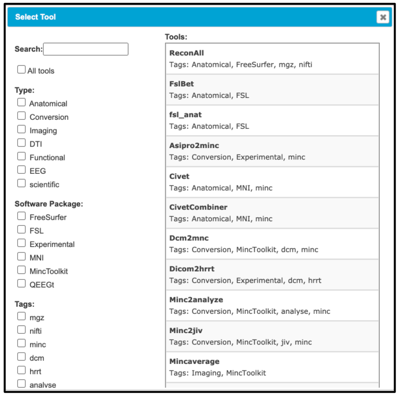

#### 10. As we are interested in analyzing a structural data file, we can reduce our selection by clicking this type

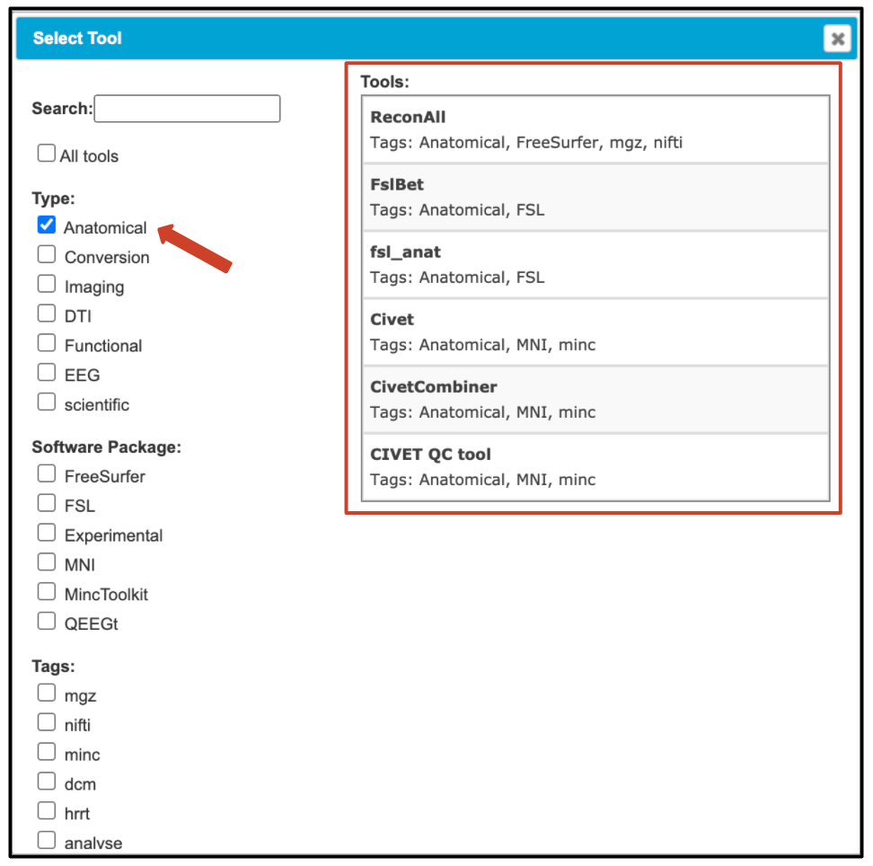

#### 11. Here is a short overview of the available pipelines for anatomical analysis:

   * _**reconAll**_
      * Performs all, or any part of, the [FreeSurfer](https://surfer.nmr.mgh.harvard.edu/fswiki/FreeSurfer) cortical reconstruction process.
further information can be found here: [recon-all](https://surfer.nmr.mgh.harvard.edu/fswiki/recon-all) 
   * _**FslBet**_
      * BET (Brain Extraction Tool) deletes non-brain tissue from an image of the whole head. It can also estimate the inner and outer skull surfaces, and outer scalp surface, if you have good quality T1 and T2 input images.
further information can be found here: [FslBet](https://fsl.fmrib.ox.ac.uk/fsl/fslwiki/BET)
   * _**fsl_anat**_
      * This tool provides a general pipeline for processing anatomical images (e.g. T1-weighted scans).
further information can be found here: [fsl_anat](https://fsl.fmrib.ox.ac.uk/fsl/fslwiki/fsl_anat)
   * _**Asipro2minc**_
      * further information: [MINC](https://en.wikibooks.org/wiki/MINC)
   * _**Civet**_
      * The CIVET project was initiated in order to create an automated, easy-to-use human brain-imaging pipeline that makes use of state-of-the-art software tools developed by researchers at the BIC for the fully-automated processing and analysis of large MR data sets, including the extraction and analysis of cortical surfaces from MR images, as well as many other volumetric and corticometric functions.
further information can be found here: [Civet](http://www.bic.mni.mcgill.ca/ServicesSoftware/CIVET-2-1-0-Table-of-Contents) 
   * _**CivetCombiner**_
   * _**CIVET QC tool**_ 
      * Quality control for Civet data analysis pipeline
      * further information can be found here: [CIVET QC tool](http://www.bic.mni.mcgill.ca/ServicesSoftware/CIVET-2-1-0-Quality-Control)

#### 12. We will use a general pipeline → **_fsl_anat_**

#### 13. Next, we choose a server, where the analysis should be performed; _**fsl_anat**_ version 5.0.9 runs on the servers “**Graham**” and “**Cedar**”. You are informed about the last wait time and can choose your favorite server based on this information.  

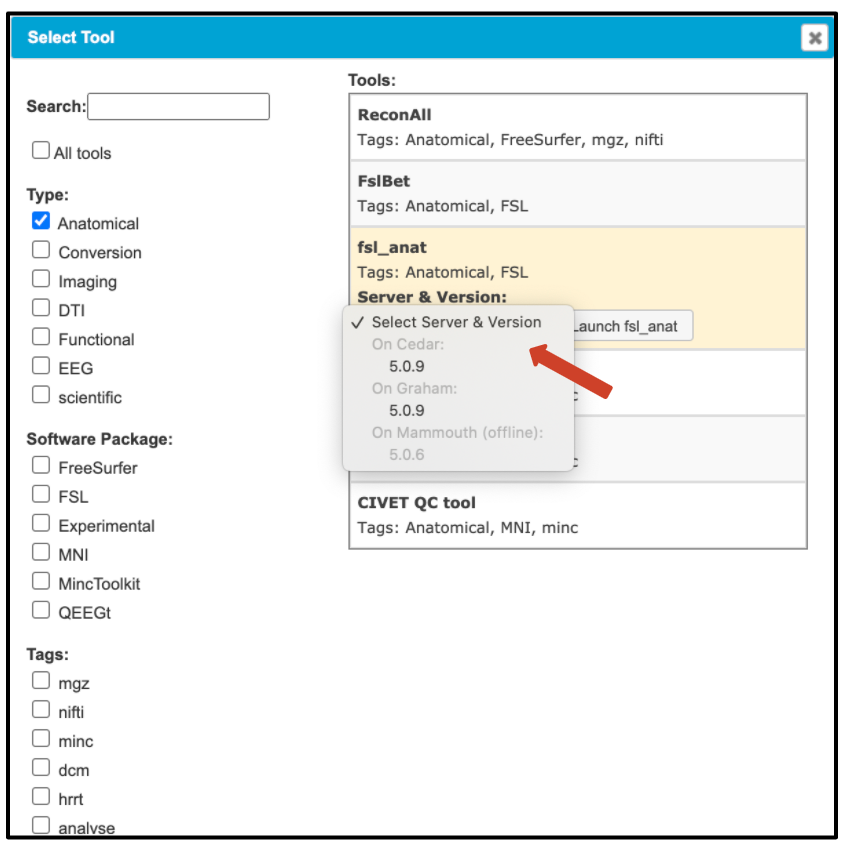
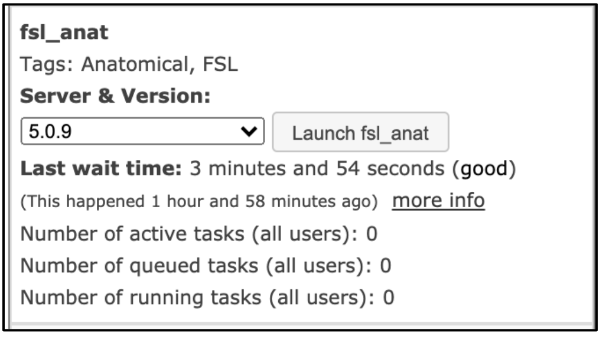

#### 14. Now, you can manage your analysis

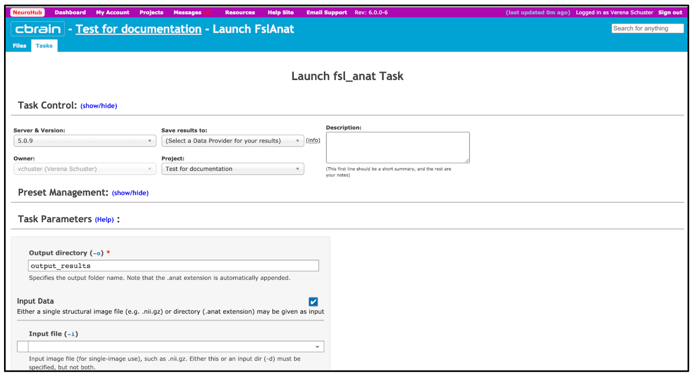

   * _**Task Control**_
      * confirm the server and version your analysis should run on and select a data provider for your results
      * click on info to get more information about the available providers
         * a wide-variety of data providers are available depending upon your project needs
      * we choose the first option “**MainStore**”, it is the main CBRAIN file storage provided by the CBRAIN team
      * choose the project, your analysis belongs to 
   * _**Task Parameters**_
      * specify your output directory and select your input Data from the drop-down menu 
      * select optional parameters if required 

#### 15. Start your analysis by clicking on “**Start fsl_anat**”

#### 16. Your task is launched in the background 

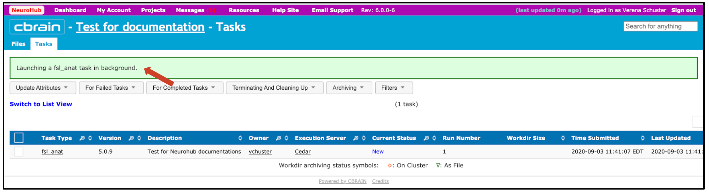

   * you can check the status of your analysis under “Current Status”

#### 17. When your task is completed, you will receive a message on your task dashboard

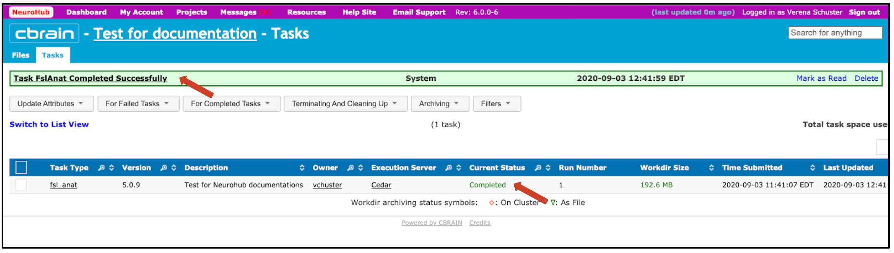

   * the output directory is located under your “**Projects**”

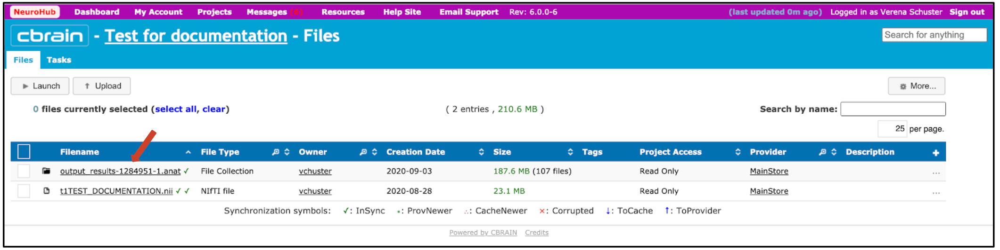
