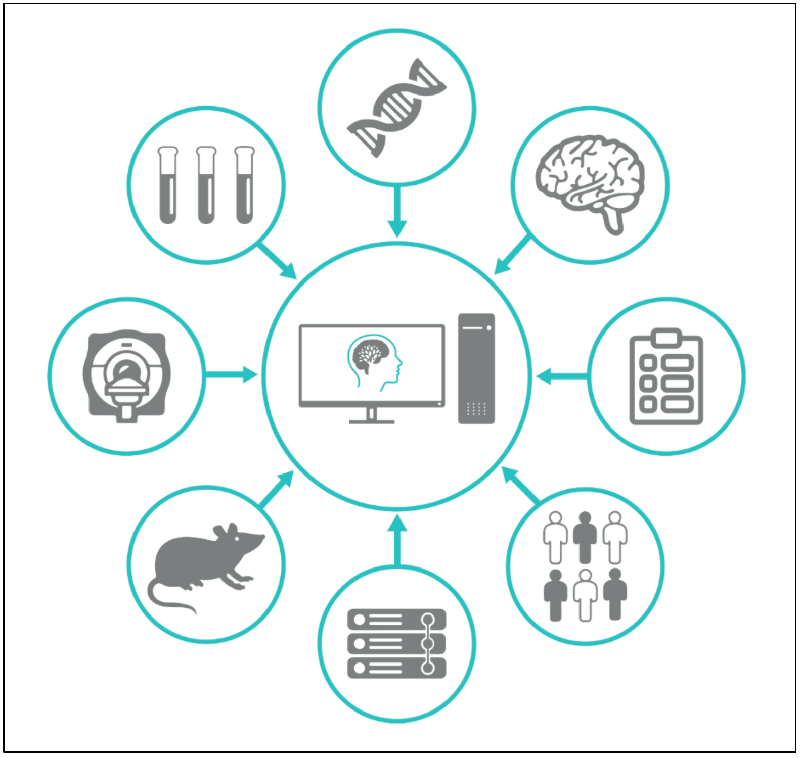

# **Welcome to the NeuroHub Wiki**

The aim of this documentation is to provide a step by step instruction in order to access and to use [NeuroHub](https://neurohub.ca/), including the upload and analysis of MRI data. 
It is roughly divided into four parts: [Getting Started](1.0.Getting-started), How to [use NeuroHub](2.1.Access-NeuroHub), [Examples](3.0.Examples) and [Supplementary Information](4.0.Supplementary-Information). 
Once successfully registered, you can access the portal [here](https://portal.neurohub.ca).
If you have questions regarding this documentation, please contact support@neurohub.ca.

## Table of Contents
#### 1. [Getting started](1.0.Getting-started)
  1. [Get a NeuroHub account](1.1.Get-a-NeuroHub-account)
  2. [Obtain UKBiobank access](1.2.UKBiobank-Access-Request)

#### 2. [Using NeuroHub](2.0.Using-NeuroHub)
  1. [Access NeuroHub](2.1.Access-NeuroHub)
  2. [Available Tools and Datasets] (2.1.Available-Tools-and-Datasets)
  3. [Access NeuroHub](2.2.Access-NeuroHub)
  2. [Creating a project](2.3.Creating-a-project)
  3. [Using the LORIS Data-Query-Tool](2.6.Using-the-LORIS-Data-Query-Tool-(DQT))
  4. [Using Jupyter Notebooks in NeuroHub](2.4.Jupyter-Notebooks)
  5. [Messaging in NeuroHub](2.5.Messaging)

#### 3. [Examples](3.0.Examples)
  1. [Analyses of structural data](3.1.Example-1-Analyses-of-structural-data)

#### 4. [Supplementary Information](4.0.Supplementary-Information)

#### 5. [Direct Access to the UK Data](5.0.Direct-UKB-Access-On-Compute-Canada)
  1. [Available Data](5.1.Available-Data)  
  2. [Accessing Data](5.2.Accessing-Data)

